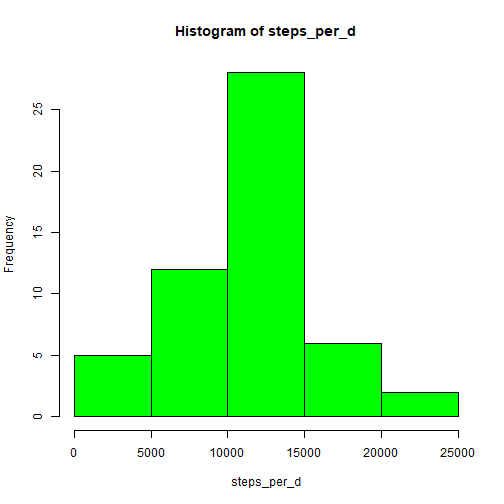
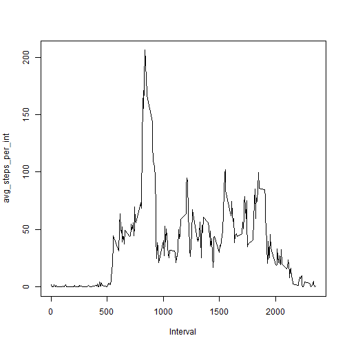
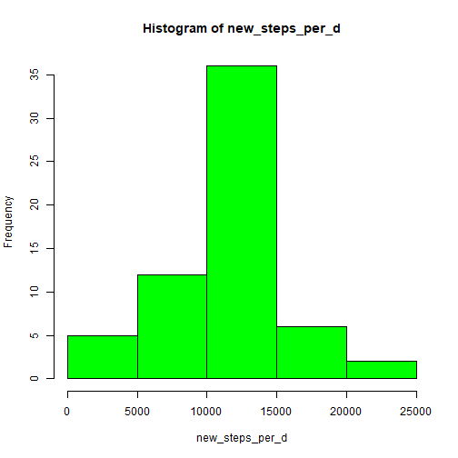
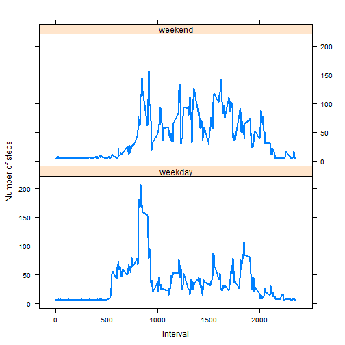

# Reproducible Research: Peer Assessment 1 

## Loading and preprocessing the data


```r
dane <- read.csv('activity.csv')
head(dane)
```

```
##   steps       date interval
## 1    NA 2012-10-01        0
## 2    NA 2012-10-01        5
## 3    NA 2012-10-01       10
## 4    NA 2012-10-01       15
## 5    NA 2012-10-01       20
## 6    NA 2012-10-01       25
```

```r
str(dane)
```

```
## 'data.frame':	17568 obs. of  3 variables:
##  $ steps   : int  NA NA NA NA NA NA NA NA NA NA ...
##  $ date    : chr  "2012-10-01" "2012-10-01" "2012-10-01" "2012-10-01" ...
##  $ interval: int  0 5 10 15 20 25 30 35 40 45 ...
```

## What is mean total number of steps taken per day?


```r
steps_per_d <- tapply(dane$steps, dane$date, sum)
hist(steps_per_d, col = "green")
```



```r
mean_steps_per_d <- mean(steps_per_d, na.rm = TRUE)
median_steps_per_d <- median(steps_per_d, na.rm = TRUE)
print(mean_steps_per_d)
```

```
## [1] 10766.19
```

```r
print(median_steps_per_d)
```

```
## [1] 10765
```

## What is the average daily activity pattern?


```r
rob <- dane[!is.na(dane$steps),]
avg_steps_per_int <- tapply(rob$steps, rob$interval, mean)

dim(avg_steps_per_int)
```

```
## [1] 288
```

```r
num_of_int <- dim(dane)[1]/(31+30)
num_of_int
```

```
## [1] 288
```

```r
plot(x=dane$interval[1:288], y=avg_steps_per_int, type = "l", xlab = "Interval")
```



```r
max(avg_steps_per_int)
```

```
## [1] 206.1698
```

```r
which.max(avg_steps_per_int)
```

```
## 835 
## 104
```

## Imputing missing values


```r
summary(dane)
```

```
##      steps            date              interval     
##  Min.   :  0.00   Length:17568       Min.   :   0.0  
##  1st Qu.:  0.00   Class :character   1st Qu.: 588.8  
##  Median :  0.00   Mode  :character   Median :1177.5  
##  Mean   : 37.38                      Mean   :1177.5  
##  3rd Qu.: 12.00                      3rd Qu.:1766.2  
##  Max.   :806.00                      Max.   :2355.0  
##  NA's   :2304
```

```r
head(!complete.cases(dane))
```

```
## [1] TRUE TRUE TRUE TRUE TRUE TRUE
```

```r
head(dane[!complete.cases(dane), ])
```

```
##   steps       date interval
## 1    NA 2012-10-01        0
## 2    NA 2012-10-01        5
## 3    NA 2012-10-01       10
## 4    NA 2012-10-01       15
## 5    NA 2012-10-01       20
## 6    NA 2012-10-01       25
```

### Proxy missing values with median_steps_per_d/num_of_int


```r
new_data <- dane
new_data[is.na(new_data$steps),"steps"] <- median_steps_per_d/num_of_int
```

### check:

```r
any(is.na(new_data))
```

```
## [1] FALSE
```

```r
new_data[1:5,]
```

```
##      steps       date interval
## 1 37.37847 2012-10-01        0
## 2 37.37847 2012-10-01        5
## 3 37.37847 2012-10-01       10
## 4 37.37847 2012-10-01       15
## 5 37.37847 2012-10-01       20
```

```r
new_steps_per_d <- tapply(new_data$steps, new_data$date, sum)
hist(new_steps_per_d, col = "green")
```



```r
mean_new_steps_per_d <- mean(new_steps_per_d)
median_new_steps_per_d <- median(new_steps_per_d)
print(mean_new_steps_per_d)
```

```
## [1] 10766.03
```

```r
print(median_new_steps_per_d)
```

```
## [1] 10765
```

## Are there differences in activity patterns between weekdays and weekends?


```r
library(lubridate)

rob2 <- wday(as.Date(new_data$date)) # 1 = Sunday, 2 = Monday, 3 = Tuesday, etc.

for (i in 1:dim(new_data)[1]) {
    if(rob2[i] == 7 | rob2[i] == 1) {
        new_data$weekdays[i] <- "weekend"
    } else {
        new_data$weekdays[i] <- "weekday" 
    } 
}

head(new_data)
```

```
##      steps       date interval weekdays
## 1 37.37847 2012-10-01        0  weekday
## 2 37.37847 2012-10-01        5  weekday
## 3 37.37847 2012-10-01       10  weekday
## 4 37.37847 2012-10-01       15  weekday
## 5 37.37847 2012-10-01       20  weekday
## 6 37.37847 2012-10-01       25  weekday
```

```r
new_data$weekdays <- as.factor(new_data$weekdays)

table(new_data$weekdays)
```

```
## 
## weekday weekend 
##   12960    4608
```

```r
table(new_data$weekdays)/288
```

```
## 
## weekday weekend 
##      45      16
```

```r
rob3 <- new_data[new_data$weekdays=="weekend",]
avg_weekend <- tapply(rob3$steps, rob3$interval, mean)
rob4 <- new_data[new_data$weekdays=="weekday",]
avg_weekday <- tapply(rob4$steps, rob4$interval, mean)
x <- c(new_data$interval[1:288], new_data$interval[1:288])
y <- c(avg_weekend, avg_weekday)
f <- as.factor(c(rep("weekend", 288), rep("weekday", 288)))

library(lattice)

xyplot(y ~ x | f, layout=c(1,2), type = "l", lwd = 2, xlab = "Interval", 
       ylab = "Number of steps")
```



